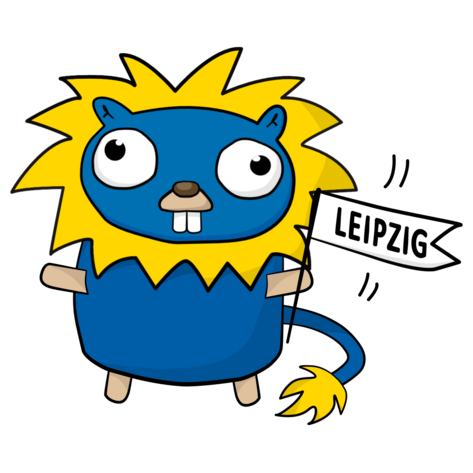
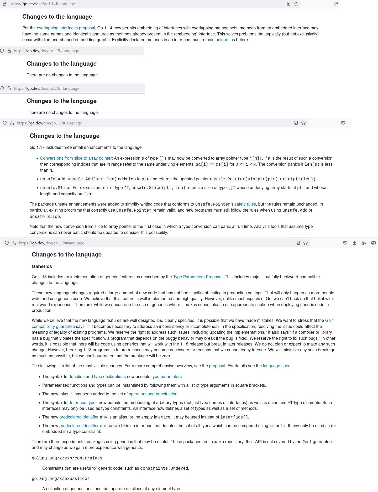
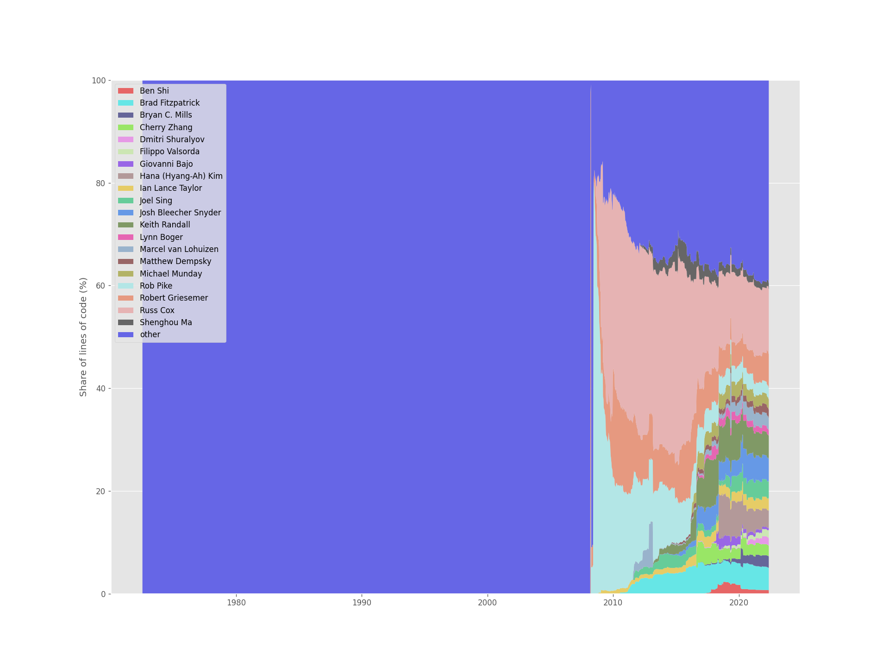
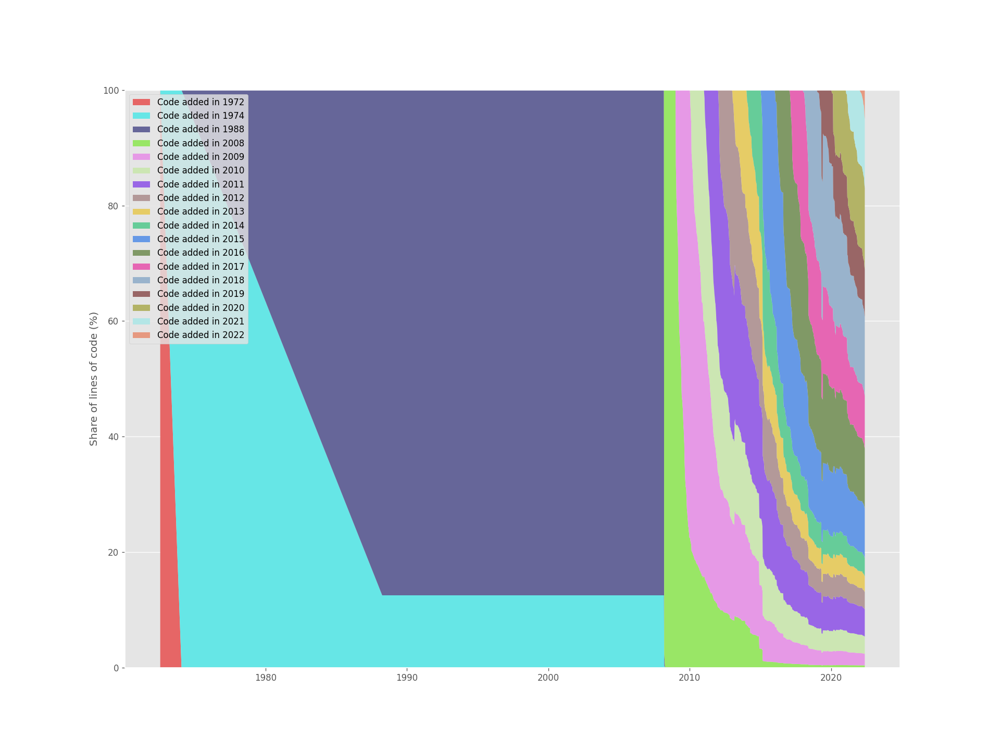
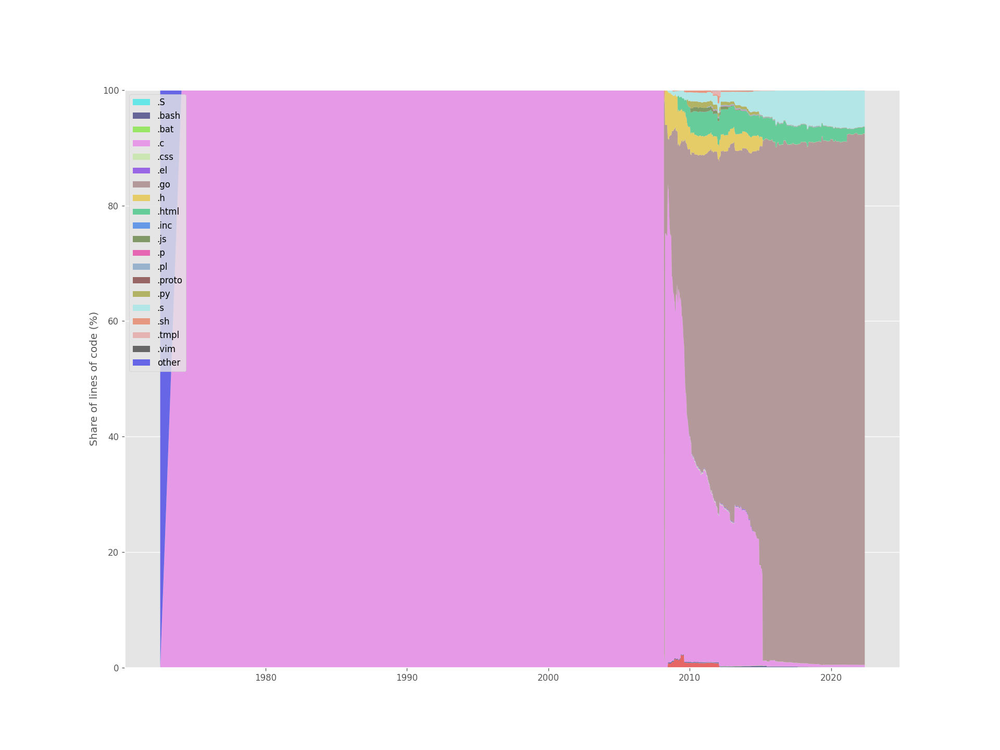

# State of Go in 2022

> What's new (since Go [1.14](https://go.dev/doc/devel/release#go1.14))?

Talk at [Leipzig Software Craft
Meetup](https://www.meetup.com/LE-software-craft-community/), date and time:
TBD.

* Andreas Linz
* Martin Czygan

## About

* co-hosting [Leipzig Gophers](https://golangleipzig.space/) since 2019
* 28+ events hosted, input presentations, code walkthroughs, discussions, quizzes, sponsors, ...
* 350 members on meetup, the pandemic brought us a truly international audience
* ...



## Change to the language



* not that much to see here; thanks! any questions?

## Go repo analysis

In fact, Go turned 50 this year.

```
$ git summary

 project  : go
 repo age : 50 years
 active   : 4822 days
 commits  : 52739
 files    : 11670
 authors  :
  7018  Russ Cox                                                    13.3%
  3854  Robert Griesemer                                            7.3%
  2983  Rob Pike                                                    5.7%
  2360  Brad Fitzpatrick                                            4.5%
  2297  Ian Lance Taylor                                            4.4%
  1537  Austin Clements                                             2.9%
  1496  Josh Bleecher Snyder                                        2.8%
  1398  Matthew Dempsky                                             2.7%
  1319  Keith Randall                                               2.5%
  1192  Andrew Gerrand                                              2.3%
  1026  Cherry Zhang                                                1.9%
   935  Bryan C. Mills                                              1.8%
   ...
```

Over 2000 committers to the core project (973 authors with more than single commit, 277 with more than 10 commit):

```
$ git shortlog -s -n | wc -l
2189
```

From a [git-of-theseus](https://github.com/erikbern/git-of-theseus) analysis
(as of 0a1a092c4b56a1d4033372fbd07924dad8cbb50b):

Authors (top 20 plus others).



Code age over time.



Extensions.



