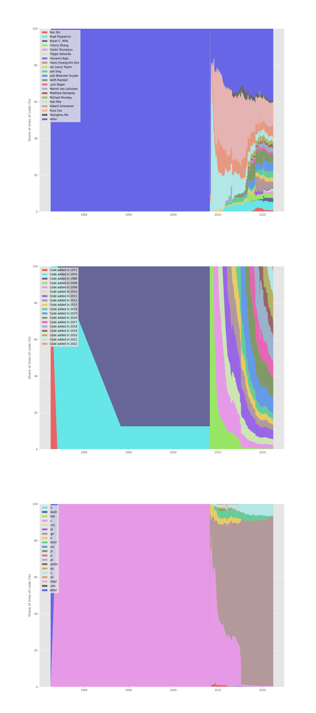

# State of Go in 2022

> What's new (since Go [1.14](https://go.dev/doc/devel/release#go1.14) 02/20)?

Talk at [Leipzig Software Craft
Meetup](https://www.meetup.com/LE-software-craft-community/), date and time:
2022-06-30 19:00 CEST.

* [Andreas Linz](https://github.com/klingtnet)
* [Martin Czygan](https://github.com/miku)

## About

* hosting [Leipzig Gophers](https://golangleipzig.space/) since [2019](https://golangleipzig.space/posts/meetup-launched/)
* 25+ events hosted, input presentations, code walkthroughs, discussions, startups, quizzes, sponsors, ...
* 400+ members on meetup, the pandemic brought us a truly international audience 🇮🇩 🇲🇪🇨🇱 🇧🇷🇧🇾🇺🇸
* ...


## Change to the language

```shell
$ git clone https://github.com/golang/website.git
$ grep -l "There are no.*changes to the language." website/_content/doc/go1.1*html
_content/doc/go1.10.html
_content/doc/go1.11.html
_content/doc/go1.12.html
_content/doc/go1.15.html
_content/doc/go1.16.html
```

5 out of the 9 past releases (Go 1.10, 2018-02-16 to 1.18, 2022-03-15) do not
contain any changes to the language.

The single biggest change to the language is the addition of generic types in
Go 1.18. All other changes have been small enhancements (like number literals,
changes in `unsafe`, ...).

## So, what changed?

We want to highlight a few changes and how they affect everyday Go development:

* move to **Go modules** for dependency management
* introduction of **generic types**
* **standard library** additions: `hash/maphash` (1.14), `time/tzdata` (1.15), `embed` (1.16), `debug/buildinfo` (1.18), `net/netip` (1.18)
* **tools** evolution (e.g. fuzz testing)

Use cases, users, ecosystem.

## Go repo analysis

In fact, Go turned 50 this year.

```
$ git summary

 project  : go
 repo age : 50 years
 active   : 4822 days
 commits  : 52739
 files    : 11670
 authors  :
  7018  Russ Cox                                                    13.3%
  3854  Robert Griesemer                                            7.3%
  2983  Rob Pike                                                    5.7%
  2360  Brad Fitzpatrick                                            4.5%
  2297  Ian Lance Taylor                                            4.4%
  1537  Austin Clements                                             2.9%
  1496  Josh Bleecher Snyder                                        2.8%
  1398  Matthew Dempsky                                             2.7%
  1319  Keith Randall                                               2.5%
  1192  Andrew Gerrand                                              2.3%
  1026  Cherry Zhang                                                1.9%
   935  Bryan C. Mills                                              1.8%
   ...
```

Over 2000 committers to the core project (973 authors with more than single commit, 277 with more than 10 commit):

```
$ git shortlog -s -n | wc -l
2189
```

From a [git-of-theseus](https://github.com/erikbern/git-of-theseus) analysis
(as of 0a1a092c4b56a1d4033372fbd07924dad8cbb50b): authors (top 20 plus others),
code age, extensions (move from [C to Go](https://go.dev/doc/go1.5#c) in 1.5):




